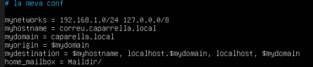
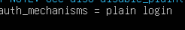
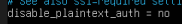
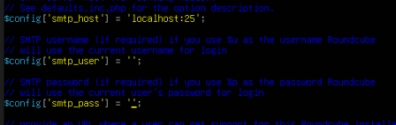
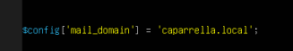
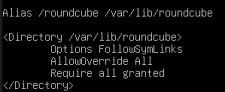
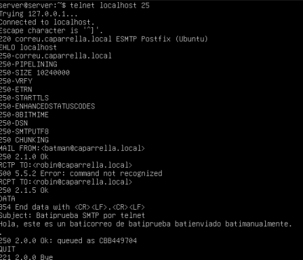

# Guía de Instalación: Servidor de Correo en Ubuntu

Este documento detalla los pasos seguidos para configurar un servidor de correo completo con Postfix, Dovecot y Roundcube en un entorno Ubuntu.

## 1. Actualización y LAMP

Primero, actualizamos el sistema e instalamos el servidor web y la base de datos necesarios para el webmail.
```bash
sudo apt update && sudo apt upgrade
sudo apt install apache2 mysql-server -y
sudo apt install php php-mysql php-intl php-xml php-mbstring php-curl php-zip -y
```
## 2.Instalación de Postfix (Envío) 
Aquí se instala el entorno necesario para aplicaciones web. Apache permitirá acceder vía navegador, MySQL almacenará datos y PHP ejecutará aplicaciones como el webmail.
Instalamos el servidor SMTP.
```bash
sudo apt install postfix
```
Instalamos soporte con Dovecot.
```bash
sudo apt install postfix dovecot-imapd
sudo apt install postfix dovecot-pop3d
```
Configuramos el archivo principal.
```bash
sudo nano /etc/postfix/main.cf
```
```conf

# /etc/postfix/main.cf
myhostname = caparrella.local
mydomain = caparrella.local
myorigin = /etc/mailname
inet_interfaces = all
mydestination = $myhostname, localhost.$mydomain, localhost, $mydomain
home_mailbox = Maildir/
```
Importante: esta configuración debe añadirse al final del archivo /etc/postfix/main.cf.



## 3. Configuración de Dovecot (Recepción)
Instalamos Dovecot:
```bash
sudo apt install dovecot-core dovecot-imapd dovecot-pop3d -y
```
Configuramos el almacenamiento:
```bash
sudo nano /etc/dovecot/conf.d/10-mail.conf
```
```conf
mail_location = maildir:~/Maildir
```
Configuramos autenticación:
```bash
sudo nano /etc/dovecot/conf.d/10-auth.conf
```
```conf
disable_plaintext_auth = no
auth_mechanisms = plain login
```




## 4. Roundcube (Webmail)

Instalamos Roundcube:

```bash
sudo apt install roundcube roundcube-core roundcube-mysql
```
Configuramos:
```bash
sudo nano /etc/roundcube/config.inc.php
```
```conf
$config['smtp_host'] = 'localhost:25';
$config['mail_domain'] = 'caparrella.local';
```


A continuación, debes añadir la siguiente configuración al final del archivo.



A continuación, abriremos el archivo de configuración de Apache2 y añadiremos el siguiente código al final del mismo.
```bash
sudo nano /etc/apache2/conf-available/roundcube.conf 
```
```confi
Alias /roundcube /var/lib/roundcube

<Directory /var/lib/roundcube>
    Options FollowSymLinks
    AllowOverride All
    Require all granted
</Directory>
```



## 5. Usuarios de Prueba

Para verificar que todo funciona, creamos dos usuarios y generamos sus directorios de correo correspondientes:
```bash
sudo adduser batman
sudo maildirmake.dovecot /home/batman/Maildir
sudo chown -R batman:batman /home/batman/Maildir

sudo adduser robin
sudo maildirmake.dovecot /home/robin/Maildir
sudo chown -R robin:robin /home/robin/Maildir
```

##6. Prueba con Telnet
```bash
telnet localhost
```
```conf
EHLO localhost
MAIL FROM:<batman@caparrella.local>
RCPT TO:<robin@caparrella.local>
DATA
Subject: Prueba de correo

Correo de prueba
.
QUIT
```



